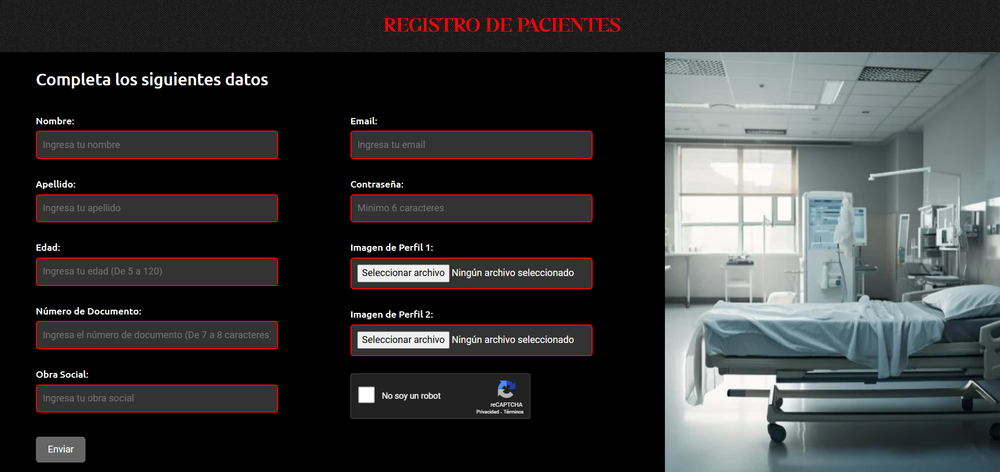
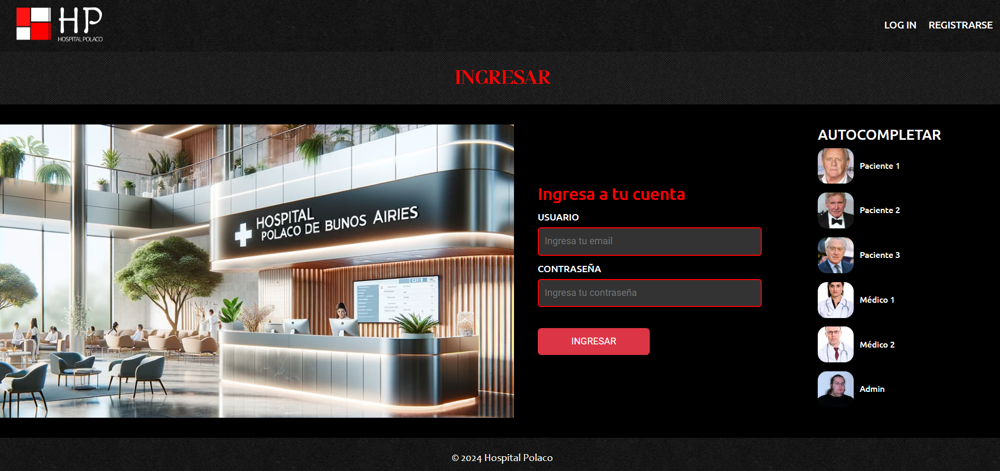
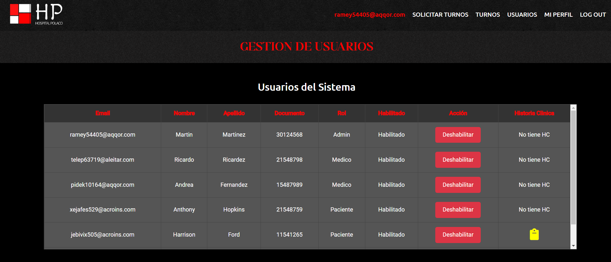
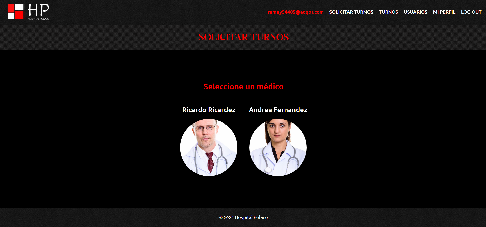
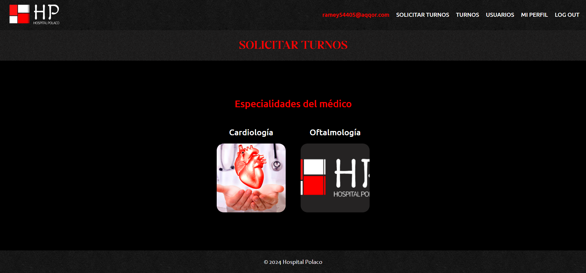
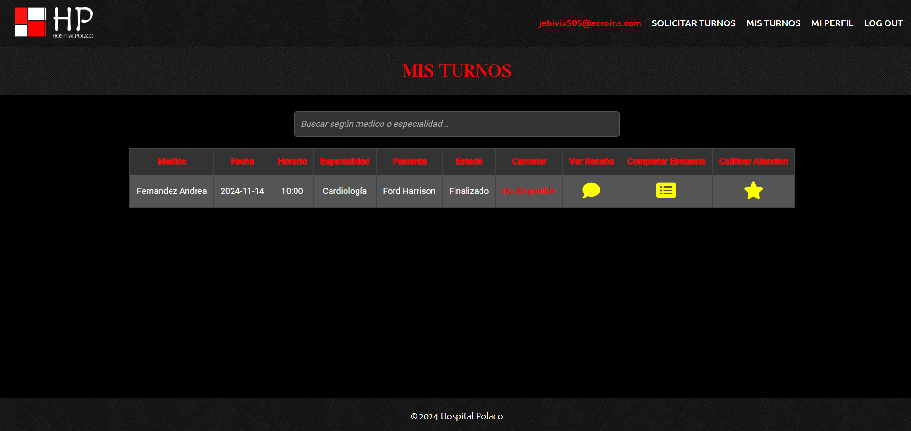
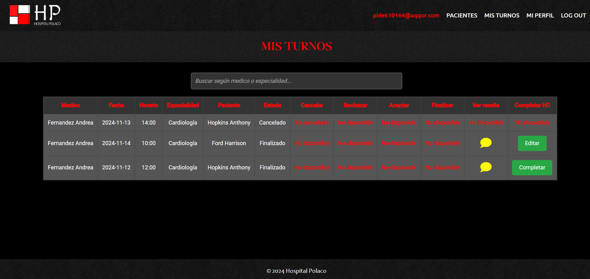
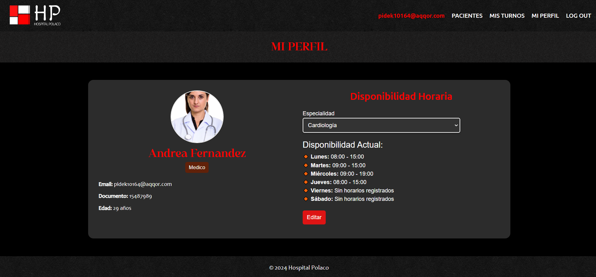
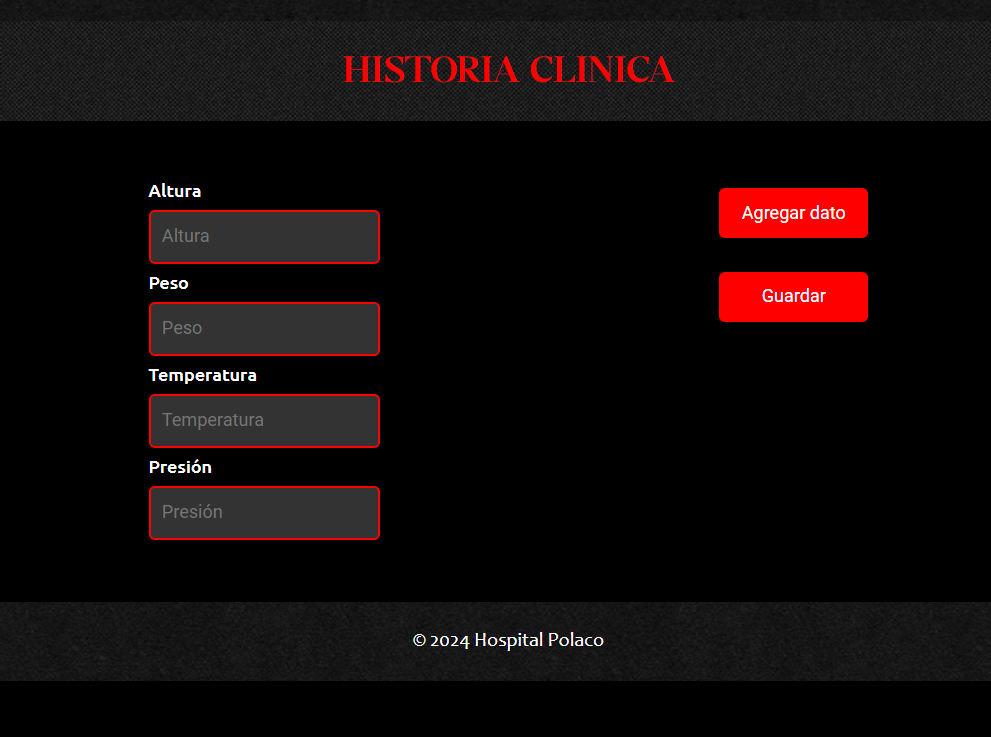
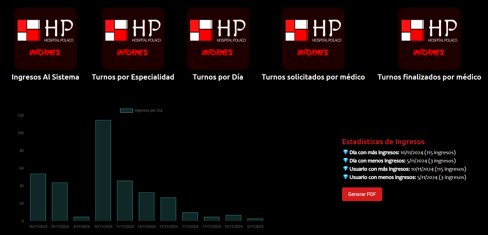

# Hospital Polaco de Buenos Aires

## Descripción General
Este proyecto representa el portal web del **Hospital Polaco de Buenos Aires**, en donde se pueden gestionar turnos médicos, consultas, y la administración de pacientes y especialistas. Este permite un manejo eficiente de las citas médicas, facilitando la interacción entre pacientes, especialistas y administradores en un entorno seguro y fácil de usar.

El hospital cuenta con 6 consultorios, dos laboratorios físicos y una sala de espera general. El horario de atención es de lunes a viernes de 8:00 a 19:00 y los sábados de 8:00 a 14:00.

## Deploy

Podrás acceder al portal web mediante el siguiente link de acceso:

https://segundo-examen-labo-iv.web.app/home

## Pantallas y Secciones del Sistema

### Página de Bienvenida
La página de inicio del sitio web brinda una introducción al **Hospital Polaco de Buenos Aires** y ofrece acceso directo a las secciones de **login** y **registro**.
- **Accesos**: Login y Registro.
- **Contenido**: Mensaje de bienvenida y breve descripción de la clínica.

### Registro de Usuarios
Esta sección permite a los usuarios registrarse como pacientes o especialistas.
- **Datos de Pacientes**: Nombre, apellido, edad, DNI, obra social, email, contraseña y 2 imágenes de perfil.
- **Datos de Especialistas**: Nombre, apellido, edad, DNI, especialidad (con opción de agregar nuevas), email, contraseña e imagen de perfil.
- **Validaciones**: Todos los campos incluyen validaciones adecuadas para garantizar la correcta entrada de datos.
- **Captcha**: Para proteger el registro, se ha integrado un reCAPTCHA de Google.

### Login
El módulo de login permite a los usuarios autenticarse para acceder a la plataforma.
- **Accesos Rápidos**: Con el objetivo de utilizar facilmente la plataforma, se han creado usuarios predeterminados.
- **Validaciones**: Solo aquellos usuarios que hayan verificado su cuenta podrán ingresar al portal.
- **Restricciones**: Los especialistas solo pueden acceder una vez que un administrador apruebe su cuenta.

### Panel de Administración (Sección de Usuarios)
Accesible solo para los administradores, esta sección permite la gestión de usuarios.
- **Acciones**: Aceptar especialistas, inhabilitar y habilitar los usuarios del sistema y crear nuevos usuarios (pacientes, especialistas y administradores).
- **Visualización**: Información detallada de los usuarios, incluyendo sus perfiles.
- **Descarga de Excel**: Descarga de datos de usuarios en formato Excel para facilitar la gestión administrativa.

### Solicitar Turno
Esta sección permite a los pacientes y administradores solicitar turnos de manera fácil y rápida.
- **Opciones de Selección**: Especialidad, especialista, día y hora.
- **Restricciones**: Los pacientes pueden elegir turnos en un rango de hasta 15 días y según la disponibilidad del especialista.

### Mis Turnos (Pacientes y Especialistas)
Sección donde los usuarios pueden ver y gestionar sus turnos.
- **Pacientes**:
  - Visualización de turnos solicitados, con la opción de cancelarlos si no se han realizado.
  - Filtros por especialidad y especialista (sin uso de combobox).
  - Posibilidad de calificar la atención y dejar comentarios una vez que el turno ha sido finalizado.
- **Especialistas**:
  - Visualización de los turnos asignados, con opciones de aceptar, rechazar, cancelar o finalizar turnos.
  - Posibilidad de dejar una reseña o diagnóstico al finalizar un turno.

### Mi Perfil
En esta sección, los usuarios pueden ver y actualizar su información personal, incluidas las imágenes de perfil y otros datos relevantes.
- **Pacientes**: Visualización de la historia clínica y datos de contacto.
- **Especialistas**: Capacidad de ajustar su disponibilidad horaria, tomando en cuenta que pueden tener múltiples especialidades asociadas.

### Historia Clínica
Los especialistas pueden cargar y ver la historia clínica de los pacientes que han atendido al menos una vez.
- **Datos Fijos**: Altura, peso, temperatura y presión.
- **Datos Dinámicos**: Hasta tres datos adicionales con clave y valor, como "caries: 4".
- **Acceso**: Disponible desde la sección "Mi Perfil" para pacientes, y desde la sección de "Usuarios" para administradores.

### Informes y Estadísticas
Accesible solo para los administradores, esta sección ofrece estadísticas y gráficos sobre el uso del sistema.
- **Informes Disponibles**:
  - Log de ingresos al sistema, indicando usuario, día y hora.
  - Cantidad de turnos por especialidad y día.
  - Turnos solicitados y finalizados por cada médico en un intervalo de tiempo.
- **Descargas**: Posibilidad de descargar los gráficos e informes en PDF o Excel.

## Formas de Acceso a las Secciones
- **Acceso al Sistema**: Desde la página de inicio, los usuarios pueden ingresar al sistema mediante la sección de login.
- **Registro**: Disponible en la página de inicio para pacientes y especialistas.
- **Panel de Administración**: Solo accesible para administradores tras el login.
- **Mis Turnos**: Accesible desde el menú de usuario para pacientes y especialistas.
- **Mi Perfil**: Acceso desde la barra de navegación superior al iniciar sesión.

## Tecnologías Utilizadas
- **Framework**: Angular
- **Backend**: Firebase
- **Base de Datos**: Firestore
- **Estilos**: CSS y Bootstrap para un diseño responsivo
- **Seguridad**: reCAPTCHA de Google para proteger el registro de usuarios